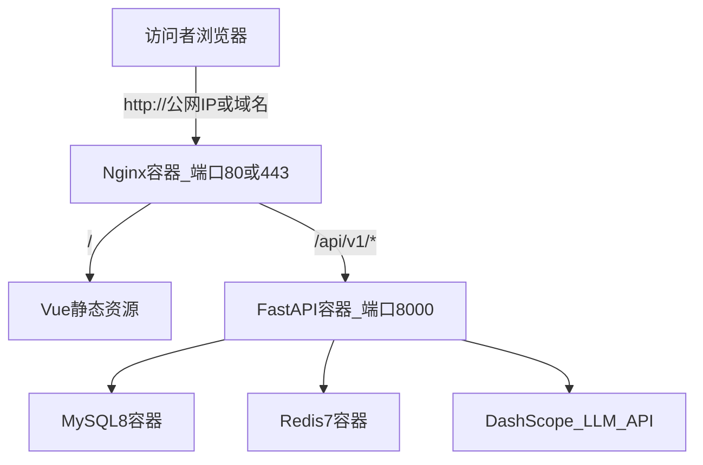

# 云服务器全 Docker 部署计划

> 将 medical-task-risk-agent 全栈 Docker 化后部署到 Linux 云服务器：先通过公网 IP + HTTP 对外访问，后续再绑定域名并启用 HTTPS。

## 目标架构



当前仓库仅有 [docker-compose.yml](./docker-compose.yml)（MySQL + Redis），**没有**应用层 Dockerfile。采用「全部 Docker 化」方案，因此部署前需先补齐以下文件（实施阶段再写代码）：

| 新增文件 | 作用 |
|---------|------|
| `backend/Dockerfile` | Python 3.11 镜像，安装 [requirements.txt](./backend/requirements.txt) |
| `backend/docker-entrypoint.sh` | 等待 MySQL 就绪 → `alembic upgrade head` → 可选 `python -m scripts.seed_bulk` → 启动 uvicorn |
| `task_risk_vue/Dockerfile` | 多阶段构建：`npm run build` + Nginx 托管 `dist` |
| `task_risk_vue/nginx.conf` | 静态站 + 将 `/api/v1` 反代到 `backend:8000` |
| `docker-compose.prod.yml` | 生产编排：mysql / redis / backend / web(nginx) |
| `.env.prod.example` | 生产环境变量模板（仓库目前无 `.env.example`） |

前端已使用相对路径 `/api/v1`（见 [task_risk_vue/src/api/http.js](./task_risk_vue/src/api/http.js)），与 Nginx 同域反代天然兼容，**无需**改 `VITE_*` 构建变量。

后端启动时会自动拉起 Reminder / Notify 后台任务（见 [backend/app/main.py](./backend/app/main.py)），**不需要**单独再起 worker 进程。

---

## 第一阶段：购买与初始化云服务器

### 1. 选购云服务器

- 推荐：**2 核 4G 内存** 起（含 LLM 调用、MySQL、Redis 较稳妥）
- 系统：**Ubuntu 22.04 LTS**（或同类 Linux）
- 磁盘：40GB+ SSD
- 常见厂商：阿里云 ECS、腾讯云 CVM、华为云等均可

### 2. 配置安全组 / 防火墙

| 端口 | 用途 | 是否对公网开放 |
|------|------|----------------|
| 22 | SSH 远程登录 | 是（建议限制为你的办公 IP） |
| 80 | HTTP 网站 | 是 |
| 443 | HTTPS（后续） | 是 |
| 3306 / 6379 / 8000 | 数据库 / 后端直连 | **否**（仅 Docker 内网） |

### 3. SSH 登录服务器

在本地 PowerShell 中（示例）：

```powershell
ssh root@你的公网IP
```

首次登录后建议：更新系统、设置时区为 `Asia/Shanghai`。

### 4. 安装 Docker 与 Docker Compose

在服务器上安装 Docker Engine 与 Compose 插件（官方一键脚本或发行版包管理器均可）。安装后验证：

```bash
docker --version
docker compose version
```

---

## 第二阶段：准备项目与生产配置

### 5. 将代码放到服务器

任选其一：

- **Git 克隆**（推荐）：`git clone <你的仓库地址> /opt/medical-task-risk-agent`
- **本地上传**：用 WinSCP / `scp` 将 `medical-task-risk-agent` 目录传到 `/opt/`

### 6. 创建生产环境变量文件

在项目根目录创建 `.env.prod`（不要提交到 Git），核心变量参考 [backend/app/core/config.py](./backend/app/core/config.py)：

```env
APP_ENV=prod
DEBUG=False

# 必改：登录与鉴权
AUTH_SECRET_KEY=随机长字符串
AUTH_DEMO_PASSWORD=强密码

# Docker 内网服务名（compose 中定义）
MYSQL_HOST=mysql
MYSQL_PORT=3306
MYSQL_USER=root
MYSQL_PASSWORD=强密码
MYSQL_DB=medical_agent

REDIS_HOST=redis
REDIS_PORT=6379

# 必配：否则 Agent 无法对话
LLM_API_KEY=sk-你的百炼Key

# 先用 IP 访问时可设为 * 或具体 IP；绑域名后改为 https://你的域名
CORS_ORIGINS=["*"]
```

**生产必改项**（默认值不安全）：

- `AUTH_SECRET_KEY`（当前默认 `dev-medflow-change-me`）
- `AUTH_DEMO_PASSWORD`（当前默认 `123456`）
- `MYSQL_PASSWORD` / `MYSQL_ROOT_PASSWORD`（与 compose 一致）

`RAG_BASE_URL` 可留空，系统会走关键词兜底，不影响主流程。

### 7. 调整生产 compose 安全策略

在 `docker-compose.prod.yml` 中应做到：

- MySQL、Redis **不映射** `3306:3306`、`6379:6379` 到宿主机
- 仅 `web`（Nginx）暴露 `80:80`（后续加 `443:443`）
- 所有服务 `restart: unless-stopped`
- 数据卷持久化：`./.data/mysql`、`./.data/redis`
- `backend` 通过 `depends_on` + healthcheck 等待 MySQL/Redis

---

## 第三阶段：构建并首次上线（公网 IP + HTTP）

### 8. 构建并启动全部容器

在项目根目录执行：

```bash
cd /opt/medical-task-risk-agent
docker compose --env-file .env.prod -f docker-compose.prod.yml up -d --build
```

`docker-entrypoint.sh` 会自动：

1. 等待 MySQL 可连接
2. 执行 `alembic upgrade head`（迁移脚本在 [backend/alembic](./backend/alembic)）
3. 首次部署可执行 `python -m scripts.seed_bulk` 灌入演示数据（见 [backend/scripts/seed.py](./backend/scripts/seed.py)）
4. 启动 `uvicorn app.main:app --host 0.0.0.0 --port 8000`

### 9. 验证服务是否正常

在服务器上：

```bash
# 查看容器状态
docker compose -f docker-compose.prod.yml ps

# 查看后端日志
docker compose -f docker-compose.prod.yml logs -f backend

# 健康检查（经 Nginx 反代）
curl http://127.0.0.1/api/v1/healthz
curl http://127.0.0.1/api/v1/readyz
```

在本地浏览器访问：

```
http://你的公网IP/
```

使用 `.env.prod` 中设置的 `AUTH_DEMO_PASSWORD` 登录，测试任务列表、智能协同对话、报告导出等核心功能。

### 10. 确认对外可访问

若浏览器打不开，按顺序排查：

1. 云厂商**安全组**是否放行 80
2. 服务器防火墙（`ufw` / `firewalld`）是否放行 80
3. `docker compose ps` 中 `web`、`backend` 是否为 `running`
4. `curl http://127.0.0.1/api/v1/readyz` 是否返回 mysql/redis 均为 true

---

## 第四阶段：日常运维（保持「随时可访问」）

### 11. 设置开机自启

- Docker 服务本身：`systemctl enable docker`
- 各容器已配置 `restart: unless-stopped`，宿主机重启后会自动拉起

### 12. 常用运维命令

```bash
# 查看日志
docker compose -f docker-compose.prod.yml logs -f backend web

# 更新代码后重新部署
git pull
docker compose --env-file .env.prod -f docker-compose.prod.yml up -d --build

# 仅重启后端
docker compose -f docker-compose.prod.yml restart backend
```

### 13. 备份

定期备份：

- `./.data/mysql` 数据目录
- `.env.prod`（含密钥，离线妥善保存）

### 14. 安全加固（建议尽早做）

- SSH 改用密钥登录，关闭密码登录
- 安全组限制 22 端口来源 IP
- 修改默认演示账号密码
- 生产环境将 `DEBUG=False`，关闭不必要的对外端口

---

## 第五阶段：后续绑定域名 + HTTPS

当你有域名后，按以下步骤升级（与当前 Docker 方案兼容）：

### 15. 域名解析

在域名服务商添加 **A 记录**：`@` 或 `www` → 指向云服务器公网 IP。

### 16. 更新 CORS

将 `.env.prod` 中 `CORS_ORIGINS` 改为：

```env
CORS_ORIGINS=["https://你的域名"]
```

重启 backend：`docker compose ... restart backend`

### 17. 配置 HTTPS

两种常见做法（二选一）：

**方案 A（推荐）**：在 `web` 容器或宿主机 Nginx 前加 **Certbot**，申请 Let's Encrypt 免费证书，监听 443 并 80 自动跳转 HTTPS。

**方案 B**：使用云厂商「SSL 证书 + 负载均衡」，在 LB 层终结 HTTPS，后端仍走 HTTP。

同时需在 `docker-compose.prod.yml` 为 `web` 增加 `443:443` 映射，并挂载证书目录。

### 18. 验证 HTTPS

浏览器访问 `https://你的域名/`，确认：

- 登录、API 请求正常
- 浏览器无混合内容 / 证书错误

---

## 实施前需在仓库中完成的开发工作（摘要）

确认本计划后，实施阶段将新增/修改：

1. `backend/Dockerfile` + `docker-entrypoint.sh`
2. `task_risk_vue/Dockerfile` + `nginx.conf`
3. `docker-compose.prod.yml`（与现有 [docker-compose.yml](./docker-compose.yml) 并存，开发环境仍可用原 compose）
4. `.env.prod.example`

**不在本次范围**（除非你明确要求）：RAG/Milvus 外部服务 Docker 化、CI/CD 自动发布、K8s 编排。

---

## 实施待办清单

- [ ] 新增 `backend/Dockerfile` 与 `docker-entrypoint.sh`（等待 MySQL、迁移、启动 uvicorn）
- [ ] 新增 `task_risk_vue/Dockerfile` 与 `nginx.conf`（静态站 + `/api/v1` 反代）
- [ ] 新增 `docker-compose.prod.yml`：mysql/redis 内网、web 暴露 80、数据卷与 healthcheck
- [ ] 新增 `.env.prod.example`，列出 AUTH/LLM/CORS 等生产必改项
- [ ] 在云服务器安装 Docker、上传代码、配置 `.env.prod` 并 `docker compose up -d --build`
- [ ] 通过公网 IP 验证页面登录、Agent 对话、readyz 健康检查
- [ ] 后续：域名 A 记录、更新 CORS、Certbot/443、HTTP 跳转 HTTPS

---

## 预估时间与成本

| 环节 | 预估 |
|------|------|
| 补齐 Docker 文件 | 约 1–2 小时 |
| 首次服务器部署与联调 | 约 1–2 小时 |
| 域名 + HTTPS | 约 30 分钟 |
| 云服务器月费 | 约 50–150 元/月（视配置与厂商） |
| LLM API | 按调用量计费（DashScope） |
